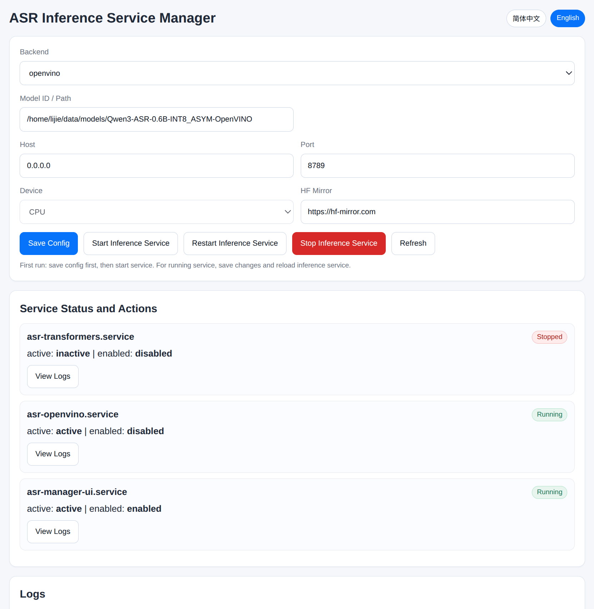
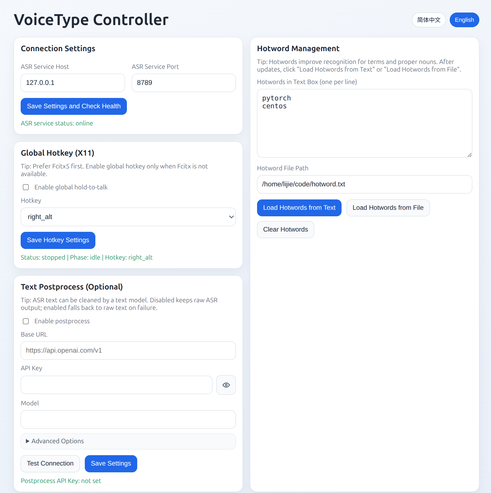
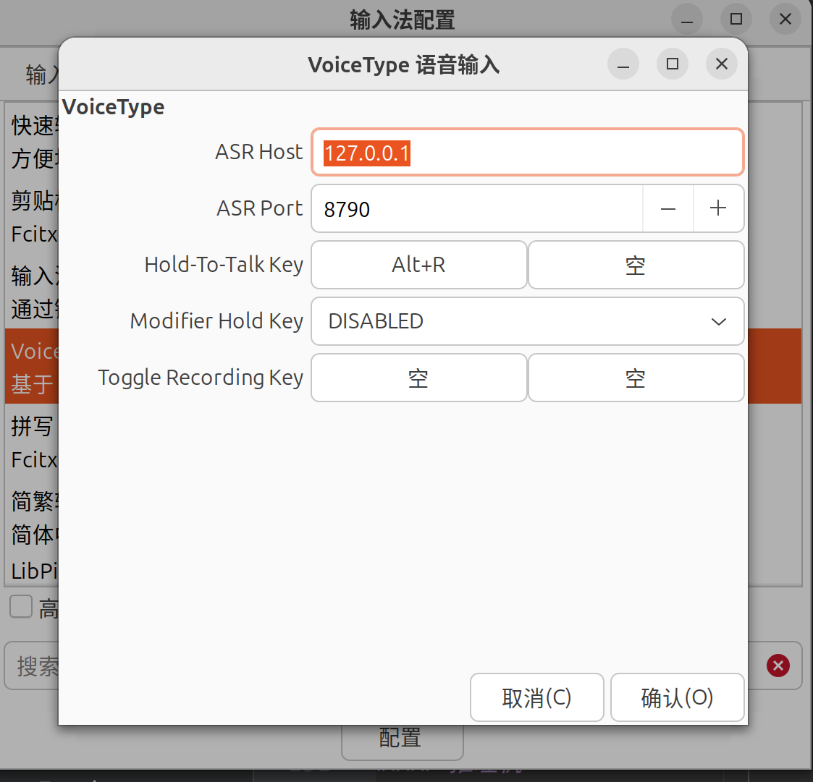

# linux-asr-voicetype

Linux 桌面的本地离线语音输入方案。

[](https://github.com/ansewuLJ/linux-asr-voicetype/stargazers)
[](https://github.com/ansewuLJ/linux-asr-voicetype/releases)
[](https://github.com/ansewuLJ/linux-asr-voicetype/releases)
[](LICENSE)

**[Stars](https://github.com/ansewuLJ/linux-asr-voicetype/stargazers) | [Release](https://github.com/ansewuLJ/linux-asr-voicetype/releases) | [Downloads](https://github.com/ansewuLJ/linux-asr-voicetype/releases) | [License](LICENSE)**

[English](README.md) | **简体中文**

这是一个面向 Linux 桌面的本地离线语音输入插件（可通过 Fcitx 或全局热键接入），默认本机推理，也支持把推理服务部署到局域网服务器。

## ✦ 特性

- 完全可本地部署，支持 CPU/CUDA，占用内存/显存 2GB+
- 基于 [Qwen3-ASR](https://huggingface.co/Qwen/Qwen3-ASR-0.6B) 模型，在中文与中英混合输入场景中表现优秀
- 在测试环境下延迟较低（例如十几秒音频可在 2 秒内完成识别，具体取决于硬件与模型）
- 支持自定义热词，降低错字概率
- 支持接入后处理文本模型，进一步优化识别效果
- 支持 Fcitx4/Fcitx5 引擎接入，也支持全局热键模式
- 支持 Transformers / OpenVINO 两种推理后端
- 可通过 UI 界面管理推理服务和接入配置

## ✦ 默认端口
- 推理服务管理面：`8788`
- 推理面：`8789`
- 控制面：`8790`

---

## ✦ 系统依赖安装

### 判断 Fcitx 版本
```bash
fcitx --version  # 显示版本号则为 Fcitx4
fcitx5 --version # 显示版本号则为 Fcitx5
```

### Debian/Ubuntu

**Fcitx5**
```bash
sudo apt install alsa-utils xdotool build-essential cmake pkg-config \
  libcurl4-openssl-dev nlohmann-json3-dev fcitx5-dev

cd frontend/fcitx5-addon
cmake -B build -DCMAKE_BUILD_TYPE=Release -DCMAKE_INSTALL_PREFIX=/usr
cmake --build build -j$(nproc)
sudo cmake --install build
fcitx5-remote -r
```

**Fcitx4**
```bash
sudo apt install alsa-utils xdotool build-essential cmake pkg-config \
  libcurl4-openssl-dev nlohmann-json3-dev fcitx-libs-dev

cd frontend/fcitx4-addon
cmake -B build -DCMAKE_BUILD_TYPE=Release -DCMAKE_INSTALL_PREFIX=/usr
cmake --build build -j$(nproc)
sudo cmake --install build
fcitx-remote -r
```

### Fedora/RHEL

**Fcitx5**
```bash
sudo dnf install alsa-utils xdotool gcc gcc-c++ make cmake pkgconf-pkg-config \
  libcurl-devel nlohmann-json-devel fcitx5-devel

cd frontend/fcitx5-addon
cmake -B build -DCMAKE_BUILD_TYPE=Release -DCMAKE_INSTALL_PREFIX=/usr
cmake --build build -j$(nproc)
sudo cmake --install build
fcitx5-remote -r
```

**Fcitx4**
```bash
sudo dnf install alsa-utils xdotool gcc gcc-c++ make cmake pkgconf-pkg-config \
  libcurl-devel nlohmann-json-devel fcitx-devel

cd frontend/fcitx4-addon
cmake -B build -DCMAKE_BUILD_TYPE=Release -DCMAKE_INSTALL_PREFIX=/usr
cmake --build build -j$(nproc)
sudo cmake --install build
fcitx-remote -r
```

---

## ✦ 服务部署
依赖 uv，先按 uv 官方文档安装：`https://docs.astral.sh/uv/getting-started/installation/`

### 单机部署

```bash
# 1. Python 依赖
cd linux-asr-voicetype
# 先确保 uv 已安装（官方安装文档见上）
# uv sync 会自动创建并使用项目虚拟环境
uv sync --all-extras
# 需要在当前 shell 里直接运行 python/pip 时，手动激活
source .venv/bin/activate

# 2. 下载模型（二选一）

# OpenVINO（CPU 推荐）
uv run voicetype model download dseditor/Qwen3-ASR-0.6B-INT8_ASYM-OpenVINO \
  --local-dir models/Qwen3-ASR-0.6B-INT8_ASYM-OpenVINO

# OpenVINO 必做：生成 prompt_template.json 和 mel_filters.npy
MODEL_DIR="models/Qwen3-ASR-0.6B-INT8_ASYM-OpenVINO"
uv run python scripts/generate_prompt_template.py --model-dir "$MODEL_DIR" --out-dir "$MODEL_DIR"

# 或 Transformers（CPU/GPU）
uv run voicetype model download Qwen/Qwen3-ASR-0.6B \
  --local-dir models/Qwen3-ASR-0.6B

# 3. 安装 systemd 服务
./scripts/install_controller_systemd.sh --ui-host 127.0.0.1 --ui-port 8790
./scripts/install_infer_systemd.sh --ui-host 0.0.0.0 --ui-port 8788

# 4. 启动管理面，配置推理服务
systemctl --user enable --now asr-manager-ui.service
# 打开 http://127.0.0.1:8788（本机）或 http://<本机IP>:8788（远程）配置模型路径、推理服务

# 5. 启动控制面
systemctl --user enable --now voicetype-ui.service
# 打开 http://127.0.0.1:8790 管理接入、热词等
```

推理服务管理界面：


初次使用先选定后端，然后保存配置后启动服务即可。

控制界面：


**接入 Fcitx（建议检查）**

- 在 Fcitx 配置 -> 附加组件里找到 `voicetype`，确认插件已启用
- 确认 `Host/Port` 指向控制面（默认 `127.0.0.1:8790`）
- 默认热键：`按住右 ALT` 录音，`松开` 后开始识别
- `Toggle Recording Key`（按一次开始、再按一次结束）默认关闭/为空；如需长语音录入，请自行设置一个顺手的快捷键



部署后自检：
- 打开 `http://127.0.0.1:8790`，确认推理服务状态在线
- 在任意可输入文本的窗口中，按住右 `ALT` 说话，松开后确认文本可正常上屏

### 双机部署

角色说明：
- 推理节点（ASR Server）：运行推理管理 UI 与推理服务（`8788/8789`），可为无图服务器
- 输入节点（Desktop Client）：你正在使用的桌面机，运行控制 UI 与输入法接入（`8790`）

#### 推理节点（ASR Server）

```bash
# Python 依赖（仅推理）
cd linux-asr-voicetype
# 先确保 uv 已安装（官方安装文档见上）
# uv sync 会自动创建并使用项目虚拟环境
uv sync --extra infer
# 需要在当前 shell 里直接运行 python/pip 时，手动激活
source .venv/bin/activate

# 下载模型（二选一）
uv run voicetype model download dseditor/Qwen3-ASR-0.6B-INT8_ASYM-OpenVINO \
  --local-dir models/Qwen3-ASR-0.6B-INT8_ASYM-OpenVINO

# OpenVINO 必做
MODEL_DIR="models/Qwen3-ASR-0.6B-INT8_ASYM-OpenVINO"
uv run python scripts/generate_prompt_template.py --model-dir "$MODEL_DIR" --out-dir "$MODEL_DIR"

# 或 Transformers
uv run voicetype model download Qwen/Qwen3-ASR-0.6B \
  --local-dir models/Qwen3-ASR-0.6B

# 安装 systemd（允许外部访问管理 UI）
./scripts/install_infer_systemd.sh --ui-host 0.0.0.0 --ui-port 8788
systemctl --user enable --now asr-manager-ui.service
# 打开 http://<推理节点IP>:8788 配置模型路径、推理服务
```

#### 输入节点（Desktop Client）

```bash
# Python 依赖（仅控制）
cd linux-asr-voicetype
# 先确保 uv 已安装（官方安装文档见上）
# uv sync 会自动创建并使用项目虚拟环境
uv sync --extra controller
# 需要在当前 shell 里直接运行 python/pip 时，手动激活
source .venv/bin/activate

# 安装并启动
./scripts/install_controller_systemd.sh
systemctl --user enable --now voicetype-ui.service
# http://127.0.0.1:8790 配置推理节点地址
```

---

## ✦ 服务控制

- 控制 UI（`voicetype-ui.service`，端口 `8790`）
```bash
systemctl --user status voicetype-ui.service   # 查看当前状态
systemctl --user restart voicetype-ui.service  # 重启服务（改配置后常用）
systemctl --user stop voicetype-ui.service     # 停止服务
```

- 管理 UI（`asr-manager-ui.service`，端口 `8788`）
```bash
systemctl --user status asr-manager-ui.service   # 查看当前状态
systemctl --user restart asr-manager-ui.service  # 重启服务（改配置后常用）
systemctl --user stop asr-manager-ui.service     # 停止服务
```

推理服务（`8789`）由管理 UI 统一启动/重载，不需要单独长期维护一个第三套操作流程。

如需清理当前用户下的全部相关服务与配置，可执行：`./scripts/uninstall_user_services.sh`

---

## ✦ 相关文件

- `~/.config/systemd/user/voicetype-ui.service`：控制 UI 的 user service 定义
- `~/.config/systemd/user/asr-manager-ui.service`：管理 UI 的 user service 定义
- `~/.config/systemd/user/asr-openvino.service`：OpenVINO 推理服务定义
- `~/.config/systemd/user/asr-transformers.service`：Transformers 推理服务定义
- `~/.config/asr-services/controller.env`：控制 UI 的 host/port 配置
- `~/.config/asr-services/manager-ui.env`：管理 UI 的 host/port 配置
- `~/.config/asr-services/openvino.env`：OpenVINO 推理参数配置
- `~/.config/asr-services/transformers.env`：Transformers 推理参数配置

---

## ✦ 致谢

- 本仓库 OpenVINO 处理链路参考了 [QwenASRMiniTool](https://github.com/dseditor/QwenASRMiniTool) 项目。
